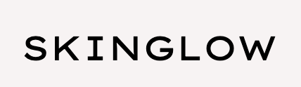
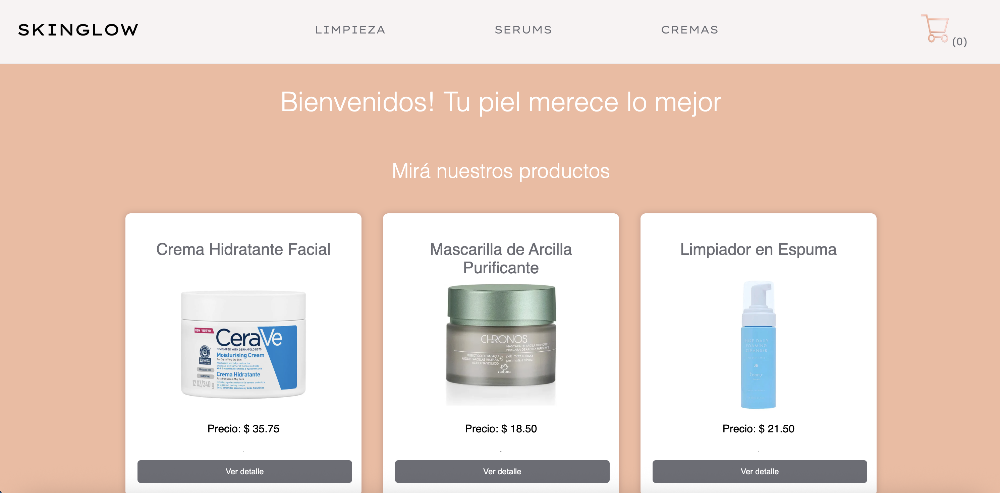

  <p align="center">
    
  </p>
 

<h4 align="center">**SkinGlow** es un ecommerce de productos de **skincare** desarrollado en <a href="http://https://es.react.dev/" target="_blank">**React**</a>.</h4>
<hr>
<p>El proyecto permite explorar productos, agregarlos al carrito, generar órdenes y guardar los datos del usuario en **Firestore**, ofreciendo una experiencia de compra completa y fluida.</p>

<p align="center">
  <a href="#tecnologias-utilizadas">Tecnologías utilizadas</a> •
  <a href="#instalacion">Instalación</a> •
  <a href="#estructura-del-proyecto">Estructura del Proyecto</a> •
  <a href="#funciones-principales">Funciones Principales</a> •
  <a href="#scripts-disponibles">Scripts Disponibles</a> •
  <a href="#creditos">Créditos</a>
  <a href="#vista-previa">Vista Previa</a>
  <a href="#agradecimientos">Agradecimientos</a>
  <a href="#repositorio">Repositorio</a>
</p>


## Tecnologías utilizadas

* ⚛️ React
* 🌐 React Router
* 🔥 Firebase / Firestore
* 💬 SweetAlert2
* 🔔 React Hot Toast
* 💅 CSS3


## Instalación

Para clonar y ejecutar esta aplicación, necesitás [Git](https://git-scm.com) y [Node.js](https://nodejs.org/en/download/) (que viene con [npm](http://npmjs.com)) instalado en tu computadora.  Desde la línea de comandos:

```bash
# Cloná este repositorio
$ git clone https://github.com/LucianaP82/SkinGlow.git

# Entrá en la carpeta del proyecto
$ cd SkinGlow

# Instalá las dependencias
$ npm install

# Ejecutá la app
$ npm start

# Abrí tu navegador
[http://localhost:5173](http://localhost:5173)
```

> **Nota**
> Si está utilizando Linux Bash para Windows[ver esta guía](https://www.howtogeek.com/261575/how-to-run-graphical-linux-desktop-applications-from-windows-10s-bash-shell/) o utilizar `node` desde el símbolo del sistema.


## Estructura del proyecto

```
📁 src
 ┣ 📂 components       # Componentes reutilizables (Navbar, ItemListContainer, ItemDetailContainer, CartContainer, etc.)
 ┣ 📂 context          # Contexto global del carrito (cartContext)
 ┣ 📂 data             # Configuración de Firebase / Firestore
 ┣ 📂 public           # Imágenes y recursos estáticos
 ┣ 📜 App.jsx          # Componente raíz del proyecto
 ┣ 📜 main.jsx         # Punto de entrada principal
 ┗ 📜 index.css        # Estilos globales
```

##  Funciones principales

-  **Agregar y eliminar productos** del carrito.  
-  **Generar órdenes de compra** y guardarlas en Firestore.  
-  **Calcular el total a pagar** en tiempo real.  
-  **Obtener la base de datos de productos** desde Firestore.  
-  **Guardar datos del usuario** al finalizar la compra.  
-  **Mostrar alertas** de confirmación con **SweetAlert2**.  
-  **Notificaciones rápidas** con **React Hot Toast**.  
-  **Navegación dinámica** mediante **React Router**.

## Scripts disponibles

| Comando | Descripción |
|----------|--------------|
| `npm run dev` | Inicia el entorno de desarrollo |
| `npm run build` | Genera la versión optimizada para producción |
| `npm run preview` | Previsualiza el build localmente |


## Créditos

**LucianaP82**  
🔗 [GitHub: LucianaP82](https://github.com/LucianaP82)

## Vista previa

<p align="center">
  
</p>

## You may also like...

- [Pomolectron](https://github.com/amitmerchant1990/pomolectron) - A pomodoro app
- [Correo](https://github.com/amitmerchant1990/correo) - A menubar/taskbar Gmail App for Windows and macOS

## Licencia

MIT

## 🙌 Agradecimientos

Este proyecto fue desarrollado como **proyecto final del curso de React de Coderhouse**.  
Gracias al profe  por el acompañamiento durante el proceso de aprendizaje y desarrollo de **SkinGlow**.  

---

## 🌐 Repositorio

👉 [https://github.com/LucianaP82/SkinGlow.git](https://github.com/LucianaP82/SkinGlow.git)
---

